# Getting Started with FluidMCP

This guide walks you through everything you need to go from zero to a fully running FluidMCP instance — installing dependencies, building the frontend, starting the backend, and using the UI to manage MCP servers and run tools.

**Time to complete:** ~15 minutes  
**Audience:** New employees and first-time users

---

## Table of Contents

1. [Prerequisites](#1-prerequisites)
2. [Install Python Dependencies](#2-install-python-dependencies)
3. [Build the Frontend](#3-build-the-frontend)
4. [Start the Backend](#4-start-the-backend)
5. [Access the API Docs (`/docs`)](#5-access-the-api-docs-docs)
6. [Access the UI (`/ui`)](#6-access-the-ui-ui)
7. [Tour of the UI Pages](#7-tour-of-the-ui-pages)
8. [Add and Start an MCP Server](#8-add-and-start-an-mcp-server)
9. [Add a Second Server (with Tools and Env Vars)](#9-add-a-second-server-with-tools-and-env-vars)
10. [View Server Details](#10-view-server-details)
11. [Set Up Environment Variables](#11-set-up-environment-variables)
12. [Run a Tool](#12-run-a-tool)

---

## 1. Prerequisites

Before you begin, make sure the following are installed on your machine:

| Requirement | Version | Check | Install |
|---|---|---|---|
| Python | 3.9+ | `python --version` | [python.org/downloads](https://www.python.org/downloads/) |
| pip | latest | `pip --version` | Included with Python; or `python -m ensurepip --upgrade` |
| Node.js | 18+ | `node --version` | [nodejs.org](https://nodejs.org/) or `nvm install 18` |
| npm | latest | `npm --version` | Included with Node.js; or `npm install -g npm` |
| Git | any | `git --version` | [git-scm.com](https://git-scm.com/downloads) or `sudo apt install git` |

**Quick install on Ubuntu / Debian (Linux / Codespaces):**

```bash
# Python + pip
sudo apt update && sudo apt install -y python3 python3-pip

# Node.js 18 via nvm
curl -o- https://raw.githubusercontent.com/nvm-sh/nvm/v0.39.7/install.sh | bash
source ~/.bashrc
nvm install 18 && nvm use 18

# Git
sudo apt install -y git
```

**Quick install on macOS:**

```bash
# Homebrew (if not installed)
/bin/bash -c "$(curl -fsSL https://raw.githubusercontent.com/Homebrew/install/HEAD/install.sh)"

# Python + Node.js + Git
brew install python node git
```

> **GitHub Codespaces users:** All of the above are pre-installed. You can skip straight to [Step 2](#2-install-python-dependencies).

<!-- SCREENSHOT PLACEHOLDER -->
<!-- File: onboarding-docs/screenshots/00-terminal-versions.png -->
<!-- Description: Terminal screenshot showing python --version, node --version, npm --version, and git --version all returning valid version numbers -->
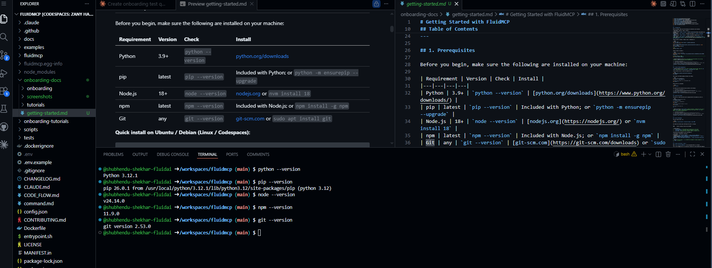

---

## 2. Install Python Dependencies

> **GitHub Codespaces users:** Your repo is already cloned and open. Skip the `git clone` step and start from `pip install -r requirements.txt` below.

**Local machine only** — clone the repository first:

```bash
git clone https://github.com/Fluid-AI/fluidmcp.git
cd fluidmcp
```

Then install the Python package (everyone runs these):

```bash
# Install Python dependencies
pip install -r requirements.txt

# Install the FluidMCP CLI in development mode
pip install -e .
```

Verify the CLI is available:

```bash
fmcp --version
```

You should see the installed version printed in the terminal.

<!-- SCREENSHOT PLACEHOLDER -->
<!-- File: onboarding-docs/screenshots/01-fmcp-version.png -->
<!-- Description: Terminal screenshot showing the output of `fmcp --version` confirming the CLI is installed -->
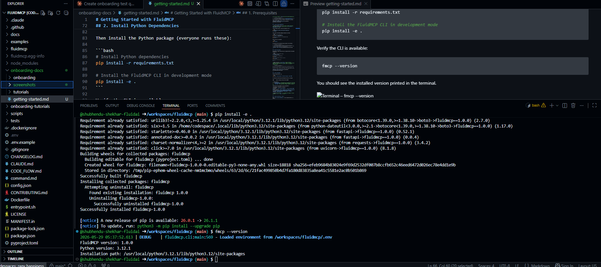

---

## 3. Build the Frontend

The web UI is a React app that must be compiled before the backend can serve it.

```bash
# Navigate to the frontend folder
cd fluidmcp/frontend

# Install Node.js dependencies
npm install

# Build the frontend (outputs to dist/)
npm run build

# Go back to the repo root
cd ../..
```

> **What this does:** `npm run build` compiles the React + TypeScript source into a static `dist/` folder. The Python backend serves this folder at the `/ui` path — there is no separate frontend server.

<!-- SCREENSHOT PLACEHOLDER -->
<!-- File: onboarding-docs/screenshots/02-frontend-build-success.png -->
<!-- Description: Terminal screenshot showing the completed `npm run build` output with the dist/ folder size summary and no errors -->
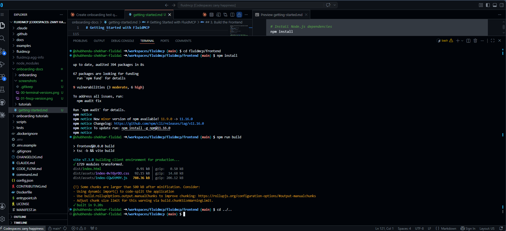

---

## 4. Start the Backend

From the **repo root**, choose the command that matches your environment:

**Local development** (no TLS, no CORS restrictions):

```bash
fmcp serve --allow-insecure --allow-all-origins --port 8099
```

**Secure mode** (TLS enabled, strict CORS — for production or shared environments):

```bash
fmcp serve --secure --port 8099
```

> Any port number works — `8099` is just the convention used in this guide. If it is already in use, pass any available port (e.g. `--port 8080`) and update your browser URL accordingly.

You should see startup logs confirming the server is running:

```
INFO:     Uvicorn running on http://0.0.0.0:8099
```

| Flag | What it does |
|---|---|
| `--allow-insecure` | Allows plain HTTP (no TLS) — for local dev only |
| `--allow-all-origins` | Disables CORS restrictions — for local dev only |
| `--secure` | Enables TLS and strict CORS — use for production or shared environments |
| `--port <number>` | Port to listen on; any available port is valid |

<!-- SCREENSHOT PLACEHOLDER -->
<!-- File: onboarding-docs/screenshots/03-backend-started.png -->
<!-- Description: Terminal screenshot showing the fmcp serve startup logs with "Uvicorn running on http://0.0.0.0:8099" confirming the server is up -->
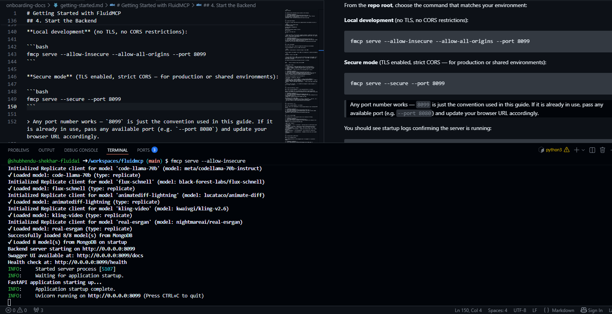

**Accessing the app depends on your environment:**

| Environment | Frontend UI | API Docs |
|---|---|---|
| Localhost | `http://localhost:8099/ui` | `http://localhost:8099/docs` |
| GitHub Codespace | `https://<codespace-name>-8099.app.github.dev/ui` | `https://<codespace-name>-8099.app.github.dev/docs` |
| Railway | `https://<your-app>.railway.app/ui` | `https://<your-app>.railway.app/docs` |

> **Note:** The root path `/` is a FastAPI info endpoint — always navigate to `/ui` or `/docs`, not just `/`.

---

## 5. Access the API Docs (`/docs`)

Open `http://localhost:8099/docs` (or your equivalent URL) in a browser.

This is the **Swagger UI** — an interactive reference for every backend API endpoint. You can use it to explore and manually call any API without writing code.

<!-- SCREENSHOT PLACEHOLDER -->
<!-- File: onboarding-docs/screenshots/03-swagger-docs.png -->
<!-- Description: Full-page screenshot of the Swagger UI at /docs showing the list of API endpoint groups -->
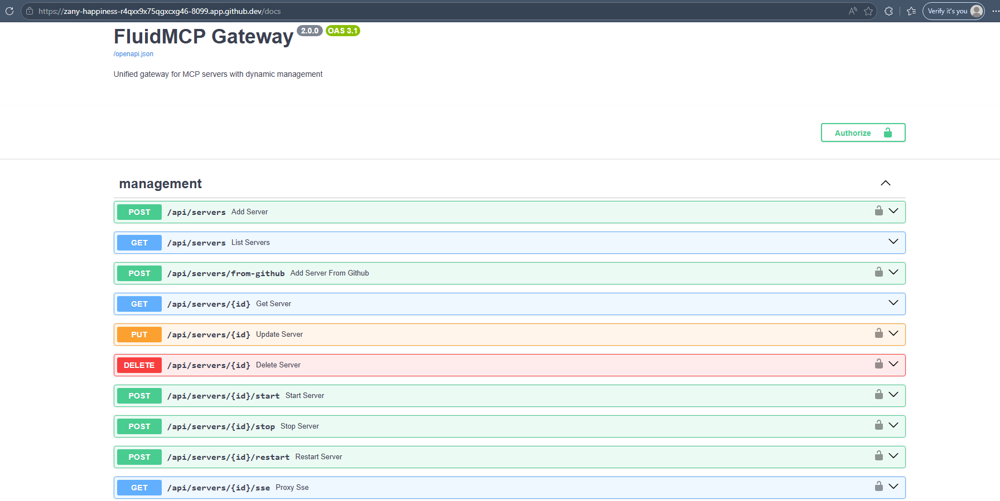

Key things to note on this page:
- Every endpoint is listed grouped by resource (`/api/servers`, `/api/llm`, etc.)
- Click any endpoint to expand it and see request/response schemas
- Use **Try it out** to call the API directly from the browser

---

## 6. Access the UI (`/ui`)

Open `http://localhost:8099/ui` in a browser.

You will land on the **Dashboard** — the main page showing all your configured MCP servers.

<!-- SCREENSHOT PLACEHOLDER -->
<!-- File: onboarding-docs/screenshots/04-dashboard-empty.png -->
<!-- Description: Screenshot of the Dashboard page (/ui) with no servers added yet, showing the empty state -->
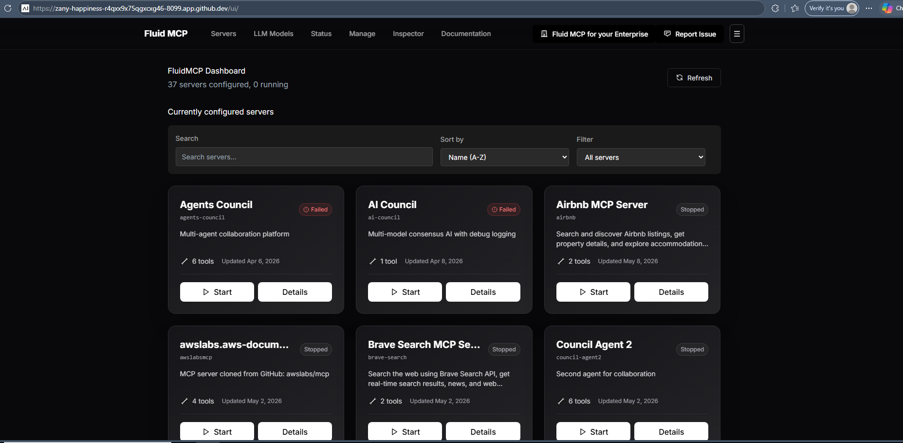

---

## 7. Tour of the UI Pages

The navigation bar at the top gives access to all sections of the app.

<!-- SCREENSHOT PLACEHOLDER -->
<!-- File: onboarding-docs/screenshots/05-navbar.png -->
<!-- Description: Close-up screenshot of the top navigation bar showing all nav links -->
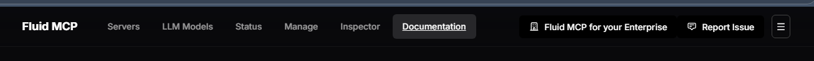

| Page | URL | Purpose |
|---|---|---|
| **Dashboard** | `/ui` or `/ui/servers` | Overview grid of all MCP servers with status badges |
| **Status** | `/ui/status` | Shows only currently running/starting servers |
| **Manage Servers** | `/ui/servers/manage` | Add, edit, delete, and disable server configurations |
| **LLM Models** | `/ui/llm/models` | Manage LLM inference models (vLLM, Ollama, Replicate) |
| **LLM Playground** | `/ui/llm/playground` | Chat interface for testing LLM models |
| **Documentation** | `/ui/documentation` | Embedded reference docs with sidebar navigation |

---

## 8. Add and Start an MCP Server

### 8.1 Go to Manage Servers

Click **Manage Servers** in the navigation bar (or navigate to `/ui/servers/manage`).

<!-- SCREENSHOT PLACEHOLDER -->
<!-- File: onboarding-docs/screenshots/06-manage-servers-empty.png -->
<!-- Description: Screenshot of the Manage Servers page before any servers have been added -->
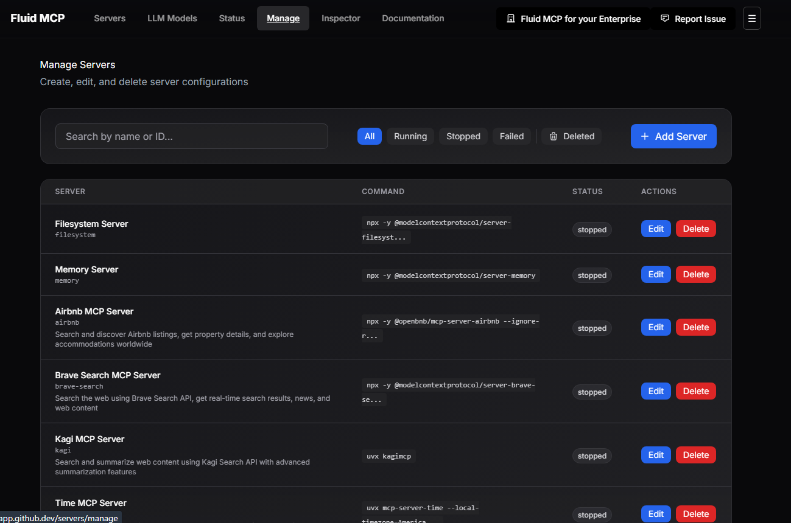

### 8.2 Add a New Server

Click **Add Server**. A modal appears with two tabs:
- **Manual Config** — enter the server name, command, args, and env vars by hand
- **Clone from GitHub** — point to a GitHub repo containing an MCP server

<!-- SCREENSHOT PLACEHOLDER -->
<!-- File: onboarding-docs/screenshots/07-add-server-modal.png -->
<!-- Description: Screenshot of the Add Server modal with the Manual Config tab selected -->
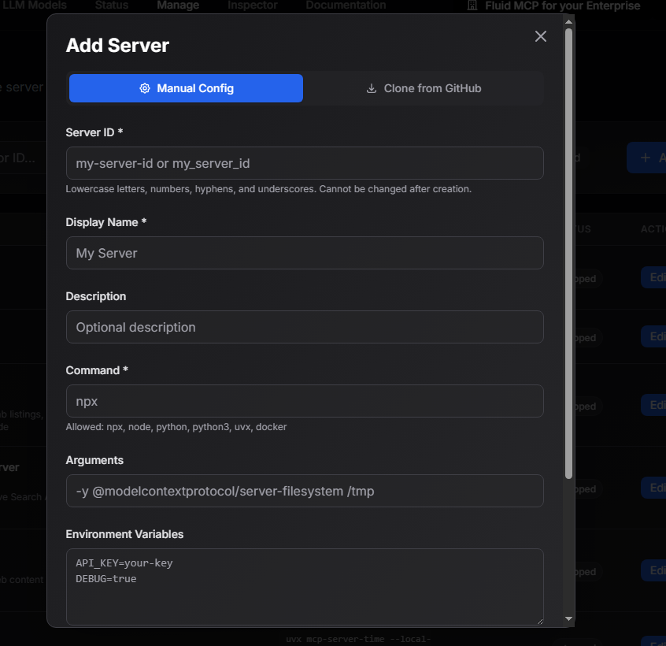

Fill in the form for a simple filesystem server as an example:

| Field | Value |
|---|---|
| **Server ID** | `filesystem` |
| **Command** | `npx` |
| **Args** | `-y @modelcontextprotocol/server-filesystem /tmp` |

Click **Save**. The server appears in the table with status `stopped`.

<!-- SCREENSHOT PLACEHOLDER -->
<!-- File: onboarding-docs/screenshots/08-manage-servers-with-entry.png -->
<!-- Description: Screenshot of the Manage Servers table after adding the filesystem server, showing it in stopped state -->
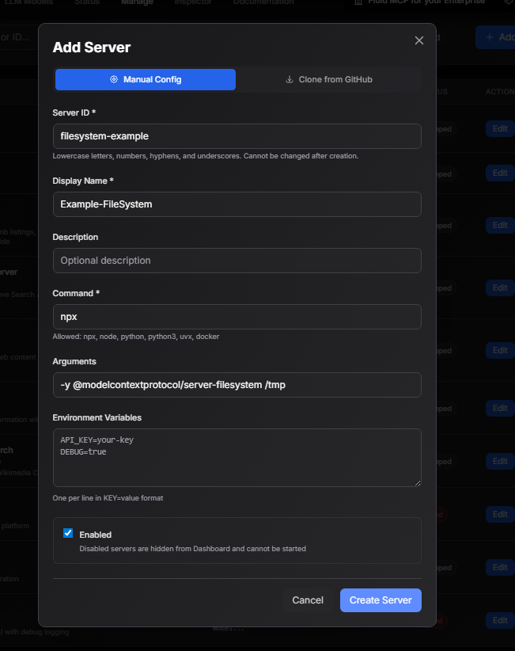

### 8.3 Start the Server from the Dashboard

Navigate to the **Dashboard** (`/ui`). Your new server appears as a card.

<!-- SCREENSHOT PLACEHOLDER -->
<!-- File: onboarding-docs/screenshots/09-dashboard-with-server.png -->
<!-- Description: Screenshot of the Dashboard showing the filesystem server card in stopped state -->
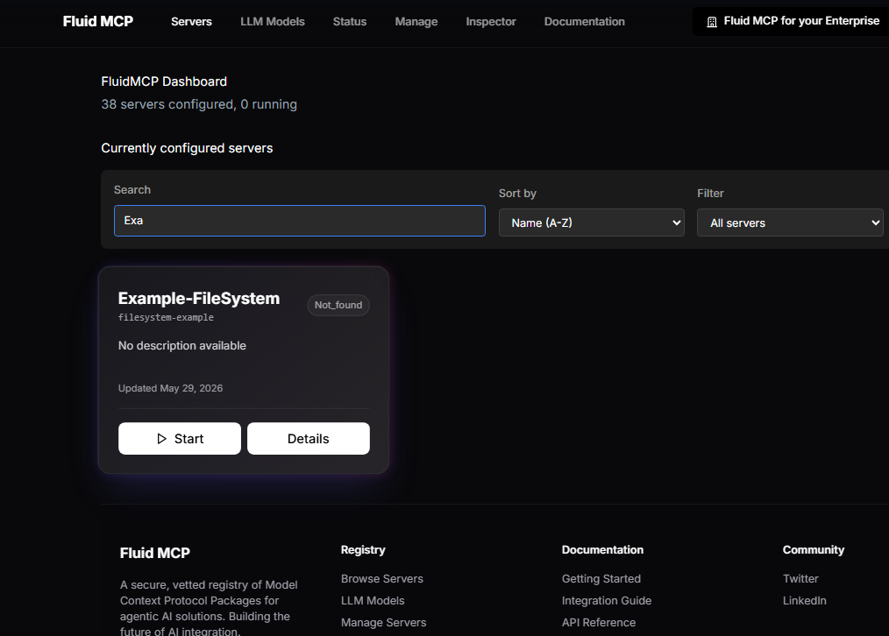

Click **Start** on the server card. The status badge changes to `starting`, then `running`.

<!-- SCREENSHOT PLACEHOLDER -->
<!-- File: onboarding-docs/screenshots/10-dashboard-server-running.png -->
<!-- Description: Screenshot of the Dashboard showing the filesystem server card with a green "running" status badge -->
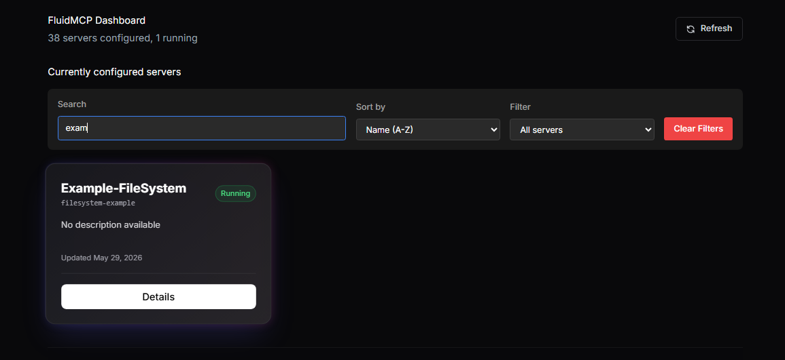

> **What happens when you start a server:** The backend spawns the MCP server as a subprocess, performs a JSON-RPC handshake to verify it is responding, and caches the list of tools it exposes.

---

## 9. Add a Second Server (with Tools and Env Vars)

The filesystem server you started is a good first step, but it doesn't expose tools in the UI. For the next sections — exploring server details, setting env vars, and running tools — let's add a second server that has all of these.

Go back to **Manage Servers** and click **Add Server** again. This time add the **Memory** server:

| Field | Value |
|---|---|
| **Server ID** | `memory` |
| **Command** | `npx` |
| **Args** | `-y @modelcontextprotocol/server-memory` |

Click **Save**, then head back to the **Dashboard** and start the `memory` server the same way you did in section 8.3.

<!-- SCREENSHOT PLACEHOLDER -->
<!-- File: onboarding-docs/screenshots/11-dashboard-two-servers.png -->
<!-- Description: Screenshot of the Dashboard showing both the filesystem and memory server cards, both in running state -->
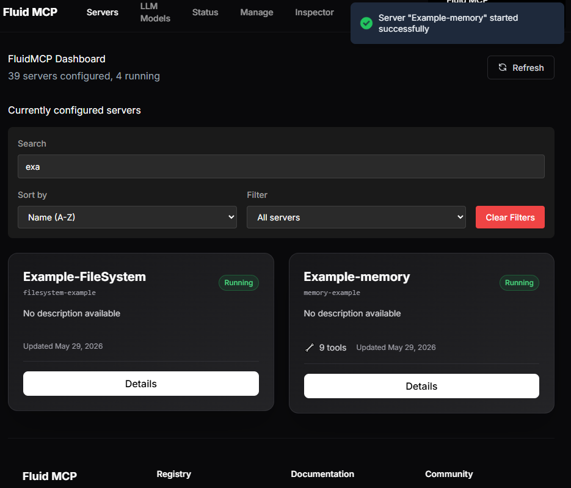

---

## 10. View Server Details

Click **View Details** on the `memory` server card. This opens the **Server Details** page, which has three tabs:

| Tab | What it shows |
|---|---|
| **Tools** | All tools exposed by this MCP server, with name and description |
| **Env** | Environment variables for this server (add, edit, delete) |

### Tools Tab

The memory server exposes several tools out of the box (`create_entities`, `search_nodes`, `add_observations`, and more).

<!-- SCREENSHOT PLACEHOLDER -->
<!-- File: onboarding-docs/screenshots/11-server-details-tools-tab.png -->
<!-- Description: Screenshot of the Server Details page for the memory server with the Tools tab open, showing the list of available tools -->
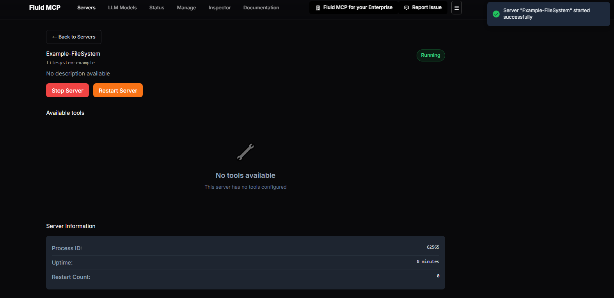

---

## 11. Set Up Environment Variables

Still on the Server Details page for the `memory` server, click the **Env** tab.

This is where you configure API keys, secrets, and any runtime configuration for the server — without hardcoding them in your config file.

<!-- SCREENSHOT PLACEHOLDER -->
<!-- File: onboarding-docs/screenshots/14-server-env-tab-empty.png -->
<!-- Description: Screenshot of the Env tab on the Server Details page, showing an empty env var list -->
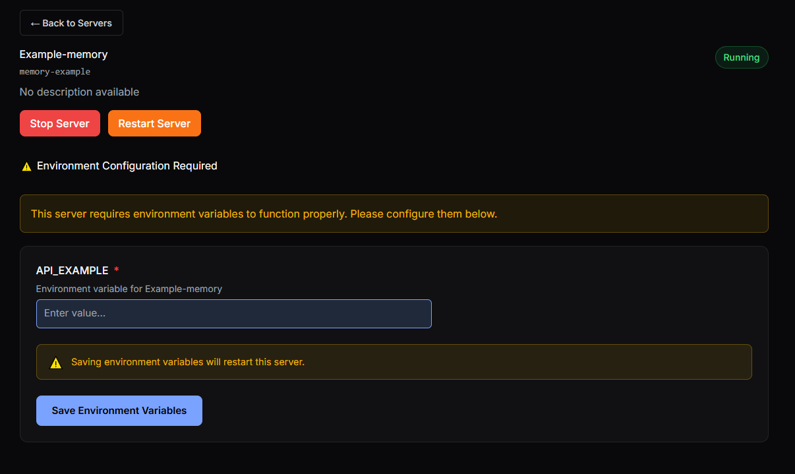

Click **Add Variable** and enter a key-value pair:

| Field | Example value |
|---|---|
| Key | `MY_API_KEY` |
| Value | `sk-abc123...` |

<!-- SCREENSHOT PLACEHOLDER -->
<!-- File: onboarding-docs/screenshots/15-server-env-tab-with-var.png -->
<!-- Description: Screenshot of the Env tab after adding an environment variable, with the value masked -->
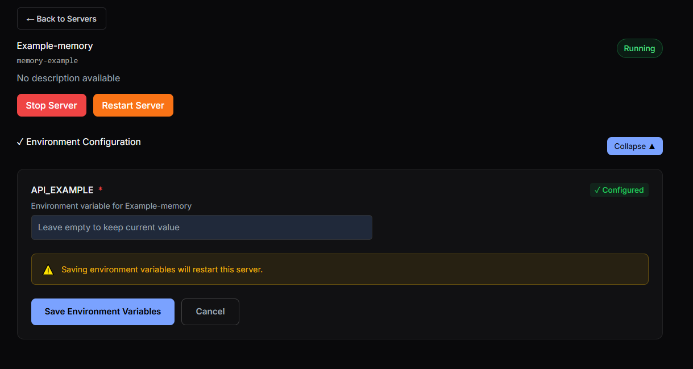

Click **Save**. The variable is applied to the running server instance.

> **Important:** Environment variable values are **masked** when displayed — the backend never returns the raw value in the API response. Changes take full effect on the next server restart.

---

## 12. Run a Tool

From the **Tools** tab on the `memory` server details page, click any tool name to open the **Tool Runner**. Try **`create_entities`** — it lets you store named entities and gives instant visible output.

<!-- SCREENSHOT PLACEHOLDER -->
<!-- File: onboarding-docs/screenshots/15-tool-runner-form.png -->
<!-- Description: Screenshot of the Tool Runner page for the create_entities tool, showing the auto-generated input form -->
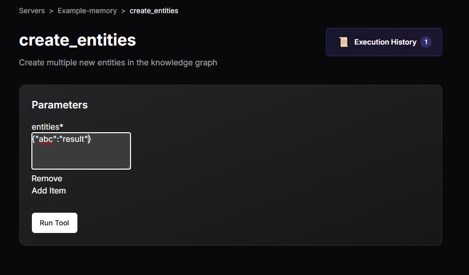

The form is auto-generated from the tool's JSON Schema. Fill in the required fields and click **Run Tool**.

<!-- SCREENSHOT PLACEHOLDER -->
<!-- File: onboarding-docs/screenshots/16-tool-runner-result.png -->
<!-- Description: Screenshot of the Tool Runner page after execution, showing the result output -->
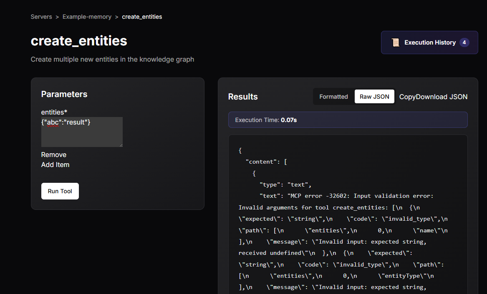

The result is displayed below the form. The UI auto-detects the output format (JSON, table, plain text, or MCP content) and renders it accordingly.

> **Tool history:** Every execution is saved in your browser's `localStorage` (up to 50 per tool). You can recall previous inputs and results without re-running the tool.

---

## Summary

You have now:

- [x] Installed Python dependencies and the `fmcp` CLI
- [x] Built the React frontend
- [x] Started the backend with `fmcp serve`
- [x] Accessed the Swagger API docs at `/docs`
- [x] Accessed the web UI at `/ui`
- [x] Toured all UI pages via the navigation bar
- [x] Added a filesystem server via Manage Servers and started it from the Dashboard
- [x] Added a memory server to explore tools and env vars
- [x] Explored Server Details — Tools, Logs, and Env tabs
- [x] Added an environment variable
- [x] Executed a tool via the Tool Runner

---

## Adding Screenshots

All screenshots referenced in this document are stored in:

```
onboarding-docs/screenshots/
```

To add a screenshot, save it to that folder with the exact filename referenced in the document (e.g. `01-swagger-docs.png`) and commit it. GitHub will then render it inline when viewing this file.

**Screenshot checklist:**

| File | Section | What to capture |
|---|---|---|
| `00-terminal-versions.png` | §1 | Terminal showing python, node, npm, git versions |
| `01-fmcp-version.png` | §2 | Terminal showing `fmcp --version` output |
| `02-frontend-build-success.png` | §3 | Terminal showing completed `npm run build` output |
| `03-swagger-docs.png` | §5 | Full Swagger UI page at `/docs` |
| `04-dashboard-empty.png` | §6 | Dashboard with no servers added |
| `05-navbar.png` | §7 | Top navigation bar |
| `06-manage-servers-empty.png` | §8.1 | Manage Servers page, empty |
| `07-add-server-modal.png` | §8.2 | Add Server modal, Manual Config tab |
| `08-manage-servers-with-entry.png` | §8.2 | Manage Servers table after adding the memory server |
| `09-dashboard-with-server.png` | §8.3 | Dashboard with stopped server card |
| `10-dashboard-server-running.png` | §8.3 | Dashboard with running server card |
| `11-dashboard-two-servers.png` | §9 | Dashboard with both filesystem and memory servers running |
| `11-server-details-tools-tab.png` | §10 | Server Details – Tools tab (memory server) |
| `14-server-env-tab-empty.png` | §11 | Env tab, empty |
| `15-server-env-tab-with-var.png` | §11 | Env tab, variable added |
| `15-tool-runner-form.png` | §12 | Tool Runner input form (create_entities) |
| `16-tool-runner-result.png` | §12 | Tool Runner result output |
